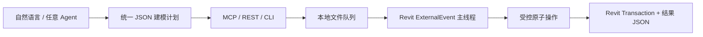

# 通用 Revit AI 执行底座

这不是“给每一种构件写一个按钮”的插件。它把任意客户端生成的建模意图收敛成 `execute_plan`，再由受控原子操作在当前 Revit 项目内执行。

JSON 计划、CLI、REST 和 MCP 契约不绑定任何模型厂商，也不绑定 Revit 年份；每个 Revit 年份使用对应 API 编译出的适配 DLL，并使用独立本地队列。

## 日常工作方式

1. 在 Revit 中打开或新建项目。
2. 让 Codex、WorkBuddy、DeepSeek Harness 或其它 Agent 先调用查询步骤，认识当前项目的标高、族、类型与元素。
3. Agent 生成一个 `execute_plan`，先以 `preview=true` 提交。
4. 预览正确后，以同一计划 `preview=false` 执行。
5. 所有写步骤要么作为一个 Revit Transaction 提交，要么整组回滚；Revit 的一次撤销即可撤回。

## 原子能力边界

| 范围 | 原子操作 | 典型用途 |
| --- | --- | --- |
| 项目理解 | `query_document`、`query_catalog`、`query_elements` | 查标高、族/类型、视图、现有构件与参数 |
| 建筑基础 | `create_level`、`create_grid`、`create_wall` | 标高、轴网、直墙 |
| 异形和临时几何 | `create_direct_shape` | 盒体、任意方向圆管、拉伸体；可组合出桁架、支座、设备占位几何 |
| 机电线性构件 | `create_mep_curve`、`connect_mep` | 管道、风管、线管、桥架及两/三接口连接 |
| 族和结构 | `place_family_instance`、`create_structural_member` | 非宿主族、梁、斜撑、柱 |
| 修改与呈现 | `set_parameters`、`delete_elements`、`select_elements` | 批量改参数、删除、定位到视图 |

这组能力可以组合出未来的大多数重复工作：例如“创建 24 根不同标高的管道、补阀门、连接、写系统编号、选中复核”是一个计划，不是 24 个新插件命令。

## 已知边界

| 状态 | 范围 | 说明 |
| --- | --- | --- |
| [V] | Revit 2020 二进制 | 使用本机 RevitAPI 20.0.0.377 编译；每个 Revit 年份使用独立 `%LOCALAPPDATA%\RevitCommandBridge\<year>` 队列。|
| [V] | 非宿主、点放置族 | `place_family_instance` 当前支持 OneLevelBased / TwoLevelsBased。|
| [T] | 门窗等宿主族、面基族、详情构件 | 需要加入 host/face/work-plane 原子放置适配，而不是为具体门窗另写插件。|
| [T] | 复杂 MEP 自动布线与碰撞绕行 | 当前支持直线管段与连接；自动路径、管综规则、避障属于上层规划器能力。|
| [T] | Revit 2021–2024 DLL 包 | 构建脚本可按目标年份调用 .NET Framework 适配构建；需要以目标年份 RevitAPI 再构建和真机验证。|
| [T] | Revit 2025–2026 DLL 包 | 协议与版本隔离已预留；需要完成 .NET 8 适配构建和真机验证。|

## 为什么不让 AI 直接跑 C# 或 Dynamo

AI 可以产生错误的任意代码。桥接只接收白名单原子操作和 JSON 参数，因此能检查目标文档、预览、事务、长度单位、元素 ID，并留下队列和结果记录。Dynamo 可以作为独立工具使用，但不是这套底座的前置条件。

完整请求格式见 [PROTOCOL.md](./PROTOCOL.md)。
