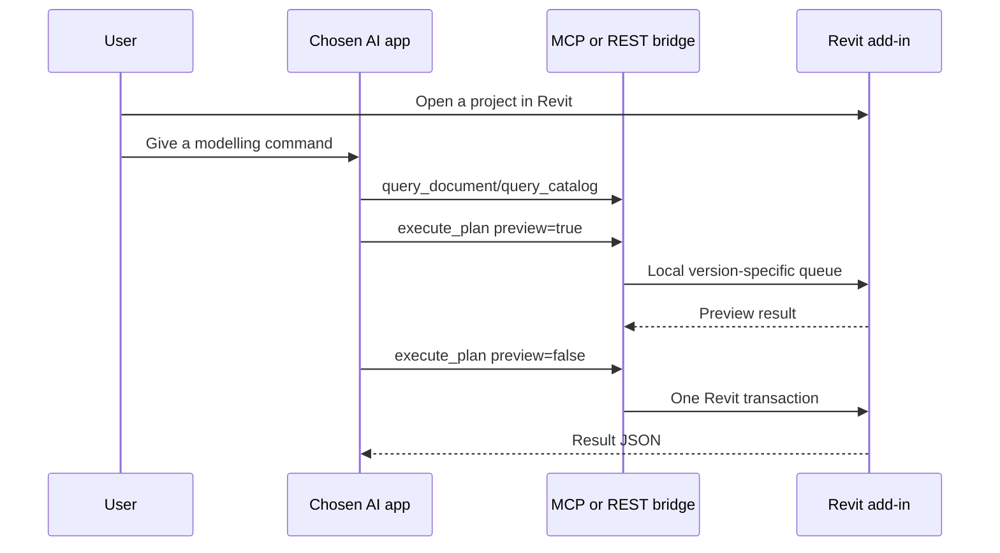

# Choose an AI application

The Revit bridge is independent of the AI application. The default installer mode detects known MCP clients and merges a version-specific Revit server into each detected configuration after making a backup. Unknown clients use the generated generic MCP/REST profiles. Changing or adding a client adapter does not require rebuilding the Revit DLL.

## Choose a connector at installation

```powershell
powershell -NoProfile -ExecutionPolicy Bypass -File .\install-revit.ps1 `
  -RevitVersion 2020 `
  -Connector codex
```

Available values are:

| Choice | Transport | Generated file | Use it when |
| --- | --- | --- | --- |
| `codex` | MCP | `codex-revit-<year>.toml` | The user connects from Codex. |
| `workbuddy` | MCP | `workbuddy-revit-<year>.mcp.json` | WorkBuddy accepts standard MCP JSON. |
| `generic-mcp` | MCP | `generic-mcp-revit-<year>.mcp.json` | Any MCP-capable desktop or server application. |
| `function-api` | REST | `function-api-revit-<year>.rest.json` | Any Function Calling or HTTP harness forwards tool calls to localhost REST. |
| `openai-compatible` | Local Chat + REST | `openai-compatible-revit-<year>.ai.json` | Any OpenAI-compatible Chat Completions API with tool calling; the package supplies a local assistant. |
| `rest` | REST | `rest-revit-<year>.rest.json` | A custom backend or automation service calls HTTP directly. |
| `deepseek` | REST | `deepseek-revit-<year>.rest.json` | Legacy alias retained for existing DeepSeek harness configurations. |
| `none` | none | none | Install the Revit part first and configure an application later. |

Generated profiles are stored under:

```text
%LOCALAPPDATA%\RevitCommandBridge\<year>\connections
```

安装器完成后可直接点击“复制 MCP 配置”，把通用 JSON 粘贴到 Codex、WorkBuddy 或其它支持 MCP 的客户端；也可点击“打开 MCP 配置目录”查看配置和导入说明。

The script deliberately generates a profile instead of silently editing another application's private configuration. The user chooses which application owns the connection and imports the relevant file.

## Configure later

```powershell
& "$env:LOCALAPPDATA\RevitCommandBridge\2020\scripts\configure-connector.ps1" `
  -Provider generic-mcp `
  -RevitVersion 2020
```

## Use your own model API

`openai-compatible` is the vendor-neutral option. It is separate from the Revit connector: the model generates tool calls, while the bridge validates and executes them locally.

The setup wizard asks for only three model values:

| Field | Meaning |
| --- | --- |
| Base URL | The provider's OpenAI-compatible API base, such as `https://api.deepseek.com/v1`. |
| Model | The exact model ID shown by that provider. |
| API Key | Stored under the current Windows user with DPAPI; it is never written to the MCP or REST connection JSON. |

For a command-line installation, configure the same protected profile interactively:

```powershell
& "$env:LOCALAPPDATA\RevitCommandBridge\2020\scripts\configure-ai-provider.ps1" `
  -RevitVersion 2020 `
  -BaseUrl 'https://YOUR-PROVIDER/v1' `
  -Model 'YOUR-MODEL'
```

Then open Revit, start the bridge, and launch the bundled local assistant:

```powershell
& "$env:LOCALAPPDATA\RevitCommandBridge\2020\scripts\start-openai-compatible-chat.ps1" `
  -RevitVersion 2020
```

The provider must support OpenAI-compatible Chat Completions and tool/function calling. A provider without that protocol can still use `function-api`, `generic-mcp`, or `rest` through its own Harness.

## Connection sequence



## Safety and everyday use

1. Start Revit and open the intended project.
2. Ask the AI to query the actual levels, families, types, and MEP systems first.
3. Submit `preview=true` before any write plan.
4. Only then submit the same plan with `preview=false`.
5. Use Revit's native undo if the completed transaction needs to be reversed.

## Evidence

- **E5 [V]** `scripts/configure-connector.ps1` generated and JSON-validated profiles for Codex, WorkBuddy, generic MCP, generic Function Calling, OpenAI-compatible local chat, and REST during local script verification.
- **E6 [V]** All generated JSON profiles parsed successfully; the Codex TOML fragment contains the version-specific queue environment.
- **E7 [V]** `configure-ai-provider.ps1` saved a test key using Windows DPAPI; a local mock OpenAI-compatible API received the tool definitions without the key in the request body.
- **E8 [T]** Import behavior for WorkBuddy and a particular third-party Harness depends on that application's own configuration format and has not been live-tested here.
