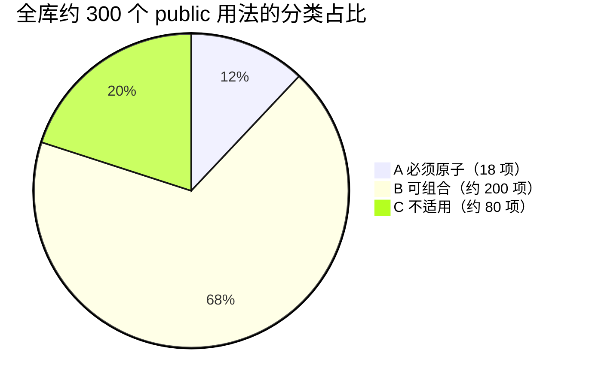

# sepd-revit-extension 全量用法分析：原子操作 vs 可组合

对 `R:\_CODE_\REVIT\sepd-revit-extension\Common.Revit.Extension.Shared\`（作者 Haotian Zhou 周昊天，面向 Revit 2024–2026）全部 46 个 C# 文件、约 300 个 public 扩展方法逐一分类，回答一个问题：**如果这里的所有用法都要在桥接中实现，哪些必须做成 `execute_plan` 白名单原子操作，哪些可以用其他操作组合出来？**

结论先行：**约 12% 必须原子化（18 个新原子，其中 5 个已在路线图）、约 68% 可由现有/已规划操作组合、约 20% 不适用于 AI 桥接场景**（UI 交互、选择拾取、事务与比较器等插件内部基础设施）。

## 0. 分类标准

| 类别 | 判定规则 |
| --- | --- |
| **A 必须原子** | 满足任一条：① 单条 Revit API 调用即完整语义，无法拆解（如 `View.Duplicate`）；② 必须在同一事务内完成，拆开会留下错误中间状态（如弯头连接需同时裁剪两管）；③ 访问参数体系之外的存储/对象（Extensible Storage、视图范围、明细表定义）；④ 组合需要 N 次往返且每次都依赖上一次结果，性能或原子性不可接受 |
| **B 可组合** | 用现有约 73 个操作 + [EXTENSION-PLAN.md](./EXTENSION-PLAN.md) 已规划操作即可编排；或纯几何/算术计算，Agent（LLM）在客户端就能算，根本不需要进 Revit |
| **C 不适用** | UI 对话框、Ribbon、交互式选择（`PickObject`）、事务包裹器、`IEqualityComparer`、单位换算——属于插件内部基础设施。AI 场景下"人工选择"由 `query_*` 感知代替，"事务"由桥接统一包裹 |

组合配方中引用的操作：现有操作直接写名字；带 ★ 的是 EXTENSION-PLAN 已规划项（P0–P3）；带 ☆ 的是本文档新提议项（见第 3 节）。

## 1. A 类：必须原子化的完整清单

### 1.1 已在 EXTENSION-PLAN 路线图中（5 项）

| 原子操作 | 来源库方法 | Revit API 入口 | 路线图位置 |
| --- | --- | --- | --- |
| `connect_mep`（elbow/tee，扩展 reducer/cross） | `MEPCurveExtension.ConnectMEPCurveElbowFitting / ConnectMEPCurveTeeFitting`、`ConduitExtension` 线管版 | `NewElbowFitting / NewTeeFitting / NewTransitionFitting / NewCrossFitting` | P0（已实现部分 + 扩展项） |
| `check_interferences` | `FilterRuleExtension.FastIntersectWith / SolidIntersectWith / FaceIntersect` | `ElementIntersectsElementFilter`、实体求交 | P1 |
| `rename_element` | `FamilyExtension.RenameAs / RenameSymbolAs / RenameByPrefixId` | `Element.Name` 赋值（`RenameByPrefixId` 的"前缀+ID"批量模式可作参数变体） | P1 |
| `manage_family_parameters` | `ParamterExtension.AddParameter / AddParameters / DeleteParameter`、`SplineExtension.CreateCurvePoints / CreateCurvePath`、`XyzExtension.CreateCurveByPoints`（族文档放样路径） | `Document.EditFamily` → `FamilyManager.AddParameter / RemoveParameter`；`FamilyDoc.Create.NewCurveByPoints` | P2 |
| 视图过滤器（创建/挂接） | `FilterRuleExtension.HasFilterWithName / GetFilterByName / DeletFilterInView / ClearFilterInView / ClearFilterElement(ByName)` | `ParameterFilterElement.Create` + `View.AddFilter / RemoveFilter` | P2（建议把删除/清除并入同一原子 `manage_view_filters`） |

### 1.2 新提议原子（13 项，按建议优先级排序）

| # | 原子操作 | 来源库方法 | Revit API 入口 | 事务类别 | 难度 | 价值说明 |
| --- | --- | --- | --- | --- | --- | --- |
| 1 | `load_family`（从 .rfa 文件加载族/类型） | `DocumentExtension.LoadFamilyBy / LoadFamilySymbolByPath / GetOrLoadSymbolByName / GetOrLoadFamilyByName / FindSymbolEntity / CreateRfaDocument` | `Document.LoadFamily(path, IFamilyLoadOptions)` | 写 | 低 | **最高频缺口**：现有 `create_family` 只能从零建族，加载现成 rfa 是另一条主路径；`FamilyLoadOptions.cs` 的 `MyFamilyLoadOptions`（静默覆盖）即其固定回调参数 |
| 2 | `query_geometry`（元素几何感知：solid/face/edge/bbox） | `GeometryExtension.GetSolidByElement / GetFaceByElement / GetEdgeByElement / GetSplineByElement`、`FamilyExtension.GetGeometrySolid / GetGeometryFace / GetInstanceTransform`、`WallExtension.GetWallFaces`、`RoofExtension.GetModelLines` | `Element.get_Geometry(Options)` 遍历 | 只读 | 中 | 大量 B 类组合的公共依赖；返回简化几何（顶点/包围盒/面积）而非全量 |
| 3 | `duplicate_view`（视图复制，含"作为复制/带细节"模式） | `ViewExtension.DuplicateByDetail / DuplicateByOption` | `View.Duplicate(ViewDuplicateOption)` | 写 | 低 | 出图工作流高频；单 API 不可拆 |
| 4 | `set_category_overrides`（视图类别图形覆盖：颜色/填充/半色调/线宽） | `ViewExtension.SetCategoryColor / SetCategoryFillPatternId / SetCategoryHalftone / SetCategoryLineWeight` | `View.GetCategoryOverrides / SetCategoryOverrides` | 写 | 中 | 深化表现核心；与 P2 `set_element_overrides` 同族，建议合并设计 |
| 5 | `query_view_range` + `set_view_range`（平面视图范围读写） | `ViewExtension.GetViewRangeTopCut / GetViewRangeCutCut / GetViewRangeBtmCut / GetViewRangeCut / HasViewRange*` | `ViewPlan.GetViewRange()` + `PlanViewRange.SetLevelId / SetOffset` | 读 / 写 | 中 | 视图范围是特殊对象，无法用参数组合；MEP 深化必备 |
| 6 | `manage_schedule_fields`（明细表字段增删/标题/显隐/过滤） | `ScheduleExtension.AddFieldToSchedule / SetFilter / SetFilters / SetTitleColumnHeadText / SwitchTitleColumnHidden` | `ScheduleDefinition.AddField / GetField`、`ScheduleFilter` | 写 | 中 | 现有 `create_schedule` 只建空表；字段与过滤是出图刚需 |
| 7 | `manage_project_parameters`（项目参数/共享参数 CRUD） | `SharedParameterExtention.CreateProjectParameterAt / ByGroup / By / ByCategories / DeleteProjectParameter / ClearProjectParameter / ReadSharedParameter / GetProjectParam` | 共享参数文件 + `Category.BoundParameters` / `DefinitionBindingMap` | 写 | 高 | 补齐"属性名层面"空白的另一路径（项目级）；对应 EXTENSION-PLAN P3"共享参数绑定"，建议升级为完整 CRUD |
| 8 | `manage_schema_data`（Extensible Storage 读写） | `SchemaExtension.SetSchemaData / GetSchemaFields / AppendSchemaData / ReplaceSchemaData / CoverSchemaData / SchemaInit / SchemaTransportBy / CreateSchema` | `SchemaBuilder` + `Element.SetEntity / GetEntity` | 写 | 中 | 参数体系之外的私有存储；适合 AI 标记来源、挂会话状态，`SchemaTransportBy`（实例间搬运）是亮点模式 |
| 9 | `set_element_curve`（修改线状图元路径） | `CurveExtension.ElementCurveAs` | `(element.Location as LocationCurve).Curve = curve` | 写 | 低 | 改墙/管走向；可设计为 `transform_elements` 的 `reshape` 模式或独立原子 |
| 10 | `create_swept_shape`（路径放样实体） | `SweepExtension.CreateSweptShape`、`CurveLoopExtension` 全部截面工厂 | `GeometryCreationUtilities.CreateSweptGeometry` + `DirectShape` | 写 | 中 | 隧道/管廊类马蹄截面构件；截面数学（`CreateHorseshoeLoop` 等）留在插件内 |
| 11 | `query_room`（房间边界 + 点找房间） | `RoomExtension.GetRoomBoundaryPoints / GetRoomBoundaryCurves / GetRoomByPoint` | `SpatialElementBoundaryOptions`、`Document.GetRoomAtPoint` | 只读 | 低 | 机电算量/定位刚需 |
| 12 | `create_view` 扩展（3D 定向视图 / drafting 视图） | `ViewExtension.CreateView3D / CreateViewDrafting / CreateViewOrientation3D / BoundingBoxByView3D` | `View3D.CreateIsometric / CreatePerspective`、`ViewDrafting.Create` | 写 | 低 | 若现有 `create_view` 的 `view_type` 已覆盖则并入参数，否则补 enum 值；相机朝向参数化 |
| 13 | `manage_graphics_resources`（线型/填充样式 get-or-create） | `LineStyleExtention.GetOrCreateLineStyle`、`FilledRegionExtension.GetOrCreateFilledRegionType / SetProperty` | `Category.LineStyles`、`FilledRegionType` 属性 | 写 | 低 | 低优先；也可并入未来标注/填充区域创建操作的参数 |

### 1.3 需核对的边界项

- `ViewExtension.CreateViewSheet / AddToViewSheet / ShiftToView(ShiftToViewSheet)`：若现有 `create_sheet` 已支持放置视图、且存在激活视图切换操作，则为 B 类；否则并入 #12 的 `create_view` 扩展。
- `FamilyExtension.CreateInstaceBySymbol`（含 View / StructuralType 重载）：现有 `create_family_instance` 若已支持 view 相关实例（详图构件），则 B 类；否则小扩展。

## 2. B 类：可通过组合实现的用法（按文件分组）

### 2.1 查询/过滤类 → `query_elements` / `query_catalog` + 客户端过滤

| 库方法（文件） | 组合配方 |
| --- | --- |
| `DocumentExtension.AllElements / FilteElemsByType / FilteElemsByCategory / FilteElemsByCategoryExclusion / FilteElemsByClassExclusion` | `query_elements(category=...)` + 客户端按 class 过滤（返回已含 `class` 字段） |
| `DocumentExtension.FilteElemsByBoxIntersect / ByBoxInside` | `query_elements` 返回 `bounding_box` + 客户端判断；或 ★`check_interferences` |
| `FamilyExtension.GetInstanceInSameSymbol / GetInstanceInSameFamily / GetSmybolInSameFamily` | `query_elements(type_name= / family=)` |
| `DocumentExtension.GetSymbols / GetSymbol` | `query_catalog(kind=types, family=)` |
| `ViewExtension.GetAllViews / GetViewDisplayName / FindViewSheetByOr/And/Name/Num` | `query_catalog(kind=views / sheets)` + 客户端过滤 |
| `TextExtension.GetTextNoteTypeByName / GetTextElementTypeByName / ByTextSize` | `query_catalog(kind=text_types)` + 客户端匹配 |
| `LevelExtension.GetCloseLevelD / GetCloseLevelU / SetLevelHeightByPoint` | `query_catalog(kind=levels)` + 客户端最近计算；写回用 `set_parameters(BIP:...)` |
| `FloorExtension.GetCloseFloor / GetCloseFloorU / GetCloseFloorD / GetCloseGeoFloor* / GetFloorByThickness` | ☆`query_geometry`（或 `query_elements` bbox）+ 客户端最近/厚度过滤 |
| `XyzExtension.GetHorizenGrids / GetVerticalGrids / GetSemi*Grids` | `query_catalog` 轴网 + 客户端方向判断 |

### 2.2 参数读写类 → `set_parameters` / `query_elements.parameters` / ☆`query_parameters`

| 库方法（文件） | 组合配方 |
| --- | --- |
| `ParamterExtension.GetParameterValue / GetParameterValue2 / GetParaVauleStr / GetParaVaule / ParameterSetToList / GetParameterByName* / GetParametersByName / GetParameterByBuiltInParameters / GetParentParameters` | ☆`query_parameters`（P1）读全部参数后客户端查找 |
| `ParamterExtension.SetParameterValue / SetFamilyParameterValue / SetSystemParameter / AddParamValue` | `set_parameters`（批量 targets；字符串追加先客户端算好） |
| `ParamterExtension.HasAllInstanceParamterNames / HasAllParamterNames / HasSymbolParameterValue / HasInstanceParameterValue` | ☆`query_parameters` 读出后客户端判断 |
| `ParamterExtension.TransportParameterValueBy`（参数值迁移） | 读源（☆`query_parameters`）→ 写目标（`set_parameters`） |
| `GeomInfoExtention.GetVolumeByParam / GetAreaByParam` | `query_elements(parameters=["体积","面积"])` |
| `BeamExtension.BeamSH / BeamEH`、`ColumnExtension.ColumnTH / TP / BH / BP / ColumnArea`、`DoorExtension.GetDoorWinWidth / Height / Area`、`FrameExtension.FrameTH / BH`、`FloorExtension.FloorTH / FloorBH`、`WallExtension.GetWallTop / GetWallBase` | 全部是"BIP 参数读取 + 算术"：`query_elements(parameters=["BIP:..."])` + 客户端计算（如 标高Elevation + offset） |
| `XyzExtension.GetLocationPoint / GetLocationCurve / GetLocationRotaion / GetLocationPointByParamter / HasMirrored` | `query_elements` 已返回 `location / curve_start / curve_end / bounding_box` |
| `CurveExtension.LocationLine` | 同上 |
| `DocumentExtension.DeleteByIds` | `delete_elements` |
| `LevelExtension.DeleteLevelByName`、`ViewExtension.DeletePlanByName` | `query_catalog` 找 ID → `delete_elements` |
| `ReferenceExtension.ModifyPosition / GeometryPosition` | `query_references` + 几何换算 |

### 2.3 几何计算类 → 纯客户端数学（Agent 自己算，或未来原子的内部实现）

| 库方法（文件） | 说明 |
| --- | --- |
| `XyzExtension` 约 80 个方法（`SetPointX/Y/Z`、`SetPositive/Minus/Scale*`、`RoundPointXYZ`、`RotationByPointUV`、`Distance*`、`IsInPolygon`、`CircleToPolygon`、`GetBox*`、`ScaleBoundingBox`、`SortPathByDistance`、`SplitPointsBy`、`GenRectUV`、`StringToXYZ/UV` 等） | 纯向量/多边形/序列化数学，LLM 客户端可算；桥接需要时作为原子内部工具 |
| `CurveExtension.IntersectPoint / SmallizeLine / SmallizeSegment / LineDivideBy* / LineSplitBySpan / ArcDivideBy / GetManhatenLines / IsHorizonUV / IsVerticalUV / IsPerpendicularUV / IsSameDirectionUV / NearCurveEdPoint / GetCloseCurveByVector` | 线段求交/缩短/等分/曼哈顿路径——布线决策算法，属 Agent 决策层 |
| `CurveLoopExtension.CreateRectangularLoop / CreatePolyLoop / CreateCircularLoop / CreateHorseshoeLoop / *RingLoop / TransformTo / GetArcCenter` | 截面轮廓工厂——☆#10 `create_swept_shape` 的内部实现 |
| `SplineExtension.GetTangents / TangentAt / ComputeRadius / MinCurvatureRadius / GetCatenaryPoints / GenCatenarySpline / PassPointByRange` | 样条/悬链线数学（电缆敷设场景），客户端或原子内部 |
| `PlaneExtension.SignedDistanceTo / ProjectOnto / ProjectInto`、`TransformExtension` 全部（`LocalToWorldBy / WorldToLocalBy / EularRot*` 等） | 平面投影/坐标变换——★`transform_elements` 与 ☆#2 `query_geometry` 的内部工具 |
| `GeometryExtension.GetGeoSolid / Mesh / Line / Point / SolidIntersectWithPoint / GetFaceByVector / GetFaceByArea / GetPointByFace / EdgeArray* 转换`、`FamilyExtension.FaceArrayToList / ToPlanarFaceList / GetInstanceAllReference` | ☆#2 `query_geometry` 返回后的客户端后处理 |
| `TextExtension.GetTextNoteWidth / GetTextWidth` | 文字测量，低频，可并入未来出图原子 |

## 3. C 类：不适用于 AI 桥接（插件内部基础设施）

| 文件 | 内容 | 不适用原因 / 桥接等价物 |
| --- | --- | --- |
| `TaskDialogExtension.cs`、`DialogExtension.cs` | `HintWinform / BuildTaskDialog` 模态对话框 | 无人值守场景禁止模态 UI；提示信息走结果 JSON |
| `SelectionHelper.cs` + 6 个 `ISelectionFilter` | `PickObject / PickObjects` 交互选择 | AI 用 `query_*` 感知代替人工选择 |
| `RibbonExtension.cs` | `AddRibbonPanel / AddSplitButton / GetImageSource / DeleteAddin` | 插件自身 UI；桥接已有 [RevitCommandBridgeApp](../src/RevitCommandBridgeApp.cs) |
| `FailureProcessor.cs` | `SetFailureHandlerOption / SetFailureHandlerTransaction` | 事务基础设施——EXTENSION-PLAN P0"失败预处理器"项的实现素材，非 Agent 操作 |
| `CommonExternalEventHandler.cs` | 单例 Action 队列外部事件 | 桥接已有队列驱动版 `BridgeEventHandler` |
| `DocumentExtension.InvokeInTransaction` | 手动事务包裹 | 桥接 `PlanCommandExecutor` 统一包裹（all-or-nothing） |
| `Comparer/`（5 个 `IEqualityComparer`） | Element/FamilyInstance/PropertyValue/UV/XYZ 比较器 | LINQ 去重基础设施 |
| `UnitConverter.cs` 全部 | mm/m ↔ ft、弧度角度全套 | 桥接已有 `FeetPerMillimeter` + `set_parameters` 单位对象（注意版本断代，见 EXTENSION-PLAN 4.2） |
| `StringExtension.cs`、`DataTransform.cs`、`DataTransformLocal.cs` | 字符串/枚举/字典工具 | 纯 .NET 工具 |
| `FamilyLoadOptions.cs` | `MyFamilyLoadOptions / SelectFamilyLoadOptions` | ☆#1 `load_family` 的回调参数（静默版），非独立操作 |
| `ConnectorExtension.cs` 全部 | `GetNearConnectors / GetNearConnector / CloseConnectorToPoint / GetRefsByConnector / GetConnectorByDescription` | 连接件最近配对算法——`connect_mep` 原子内部实现 |
| `ConduitExtension.SelectSystemByConduit` | 沿连接件遍历管网 | ★P2 `query_mep_network` 的遍历骨架 |

## 4. 统计与合并建议

- **A 类 18 项中 5 项已在路线图**：`connect_mep` 扩展、`check_interferences`、`rename_element`、`manage_family_parameters`、视图过滤器；
- **建议并入 EXTENSION-PLAN 的 13 项新原子**按批次落位：
  - **P1 追加**：`load_family`、`query_geometry`、`duplicate_view`、`set_element_curve`、`query_room`；
  - **P2 追加**：`set_category_overrides`、`query/set_view_range`、`manage_schedule_fields`、`manage_schema_data`、`create_swept_shape`、`create_view` 扩展；
  - **P3 升级**：`manage_project_parameters`（原"共享参数绑定"项扩展为完整 CRUD）、`manage_graphics_resources`；
- **B/C 类零新增**：这正是"组合优于穷举"设计哲学的印证——库中约 88% 的用法不需要新原子。

## 5. 版本与版权警示

沿用 [EXTENSION-PLAN.md](./EXTENSION-PLAN.md) 4.2 / 4.3 节结论：

1. 该库面向 **Revit 2024–2026**（`ForgeTypeId` / `SpecTypeId` 为 2021+ API），桥接最老支持 2020、最前支持 2026——移植时单位相关代码必须用桥接自有的 `FeetPerMillimeter` 体系 + `#if REVIT2022_OR_GREATER` 等递增符号重写；
2. 库内 `FilterRuleExtension.cs` 存在整段 `#if` 条件编译的重复代码块（2026 适配先例），提示其自身也在做多年份适配；
3. 每个文件头部有作者署名，逐段复制前须确认许可证与桥接 [LICENSE](../LICENSE) 兼容并补 [NOTICE.md](../NOTICE.md) 署名；仅参考算法模式重写则无此约束。

## 6. 分析方法说明

- 覆盖范围：46 个 .cs 文件全部纳入（含 `Comparer/` 与 `LocalExtension/` 子目录；`.projitems / .shproj` 为工程文件跳过）；
- 方法清单来自全库 `public static` 签名扫描（约 300+ 命中）+ 11 个文件全文精读 + 此前对 `ConnectorExtension / ConduitExtension / MEPCurveExtension / FailureProcessor / DocumentExtension / FloorExtension / GeometryExtension / FilterRuleExtension / TransformExtension / UnitConverter / CommonExternalEventHandler` 的深入分析；
- 注释掉的方法（如 `SplineExtension.EditSplinePath`、`GeomInfoExtention.InstanceVolume`）未计入。
