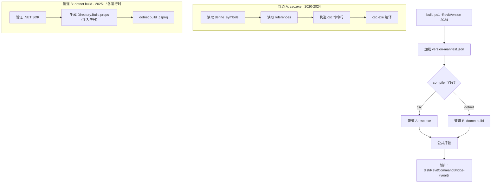

# 多版本构建管道方案

## 设计目标

- 每个 Revit 版本有独立的编译入口、运行时和项目文件
- 单一 `build.ps1` 作为统一调度器，按版本矩阵分发
- 共享源码（`src/`）通过链接方式被所有版本项目引用
- 版本差异（API、运行时、编译符号）集中在版本清单中声明

---

## 1. 版本矩阵总览

| Revit | .NET 运行时 | 编译工具 | 编译符号 | 项目文件 |
|-------|------------|---------|---------|---------|
| 2020 | .NET Framework 4.8 | `csc.exe` | _(无)_ | _无（纯命令行）_ |
| 2021 | .NET Framework 4.8 | `csc.exe` | `REVIT_FORGE_UNITS` | _无（纯命令行）_ |
| 2022 | .NET Framework 4.8 | `csc.exe` | `REVIT_FORGE_UNITS` | _无（纯命令行）_ |
| 2023 | .NET Framework 4.8 | `csc.exe` | `REVIT_FORGE_UNITS` + `REVIT_PARAMETER_GROUPS` | _无（纯命令行）_ |
| 2024 | .NET Framework 4.8 | `csc.exe` | `REVIT_FORGE_UNITS` + `REVIT_PARAMETER_GROUPS` | _无（纯命令行）_ |
| 2025 | .NET 8 | `dotnet build` | `REVIT_FORGE_UNITS` + `REVIT_PARAMETER_GROUPS` + `REVIT_NET8` + `REVIT_2025` | `src-net8/RevitCommandBridge.Adapter25.csproj` |
| 2026 | .NET 8 | `dotnet build` | 同上，`REVIT_2026` 替换 | `src-net8/RevitCommandBridge.Adapter26.csproj` |
| 2027 | **.NET 10** | `dotnet build` | 全部上述 + `REVIT_NET10` + `REVIT_2027` | `src-net10/RevitCommandBridge.Adapter27.csproj` |
| 2028+ | .NET 10+ | `dotnet build` | 按需追加 `REVIT_NET??` 符号 | 新建 `src-net??/Adapter??.csproj` |

**分群逻辑**：运行时不变则共享同一入口；运行时变了则新建入口。

---

## 2. 目录结构

```
revit-mcp-local-bridge/
│
├── src/                              ← ★ 单一事实源（22 个 .cs，全部版本共享）
│   ├── PlanCommandExecutor.cs
│   ├── RevitPlanCreations.cs
│   └── ...
│
├── build/                            ← ★ 版本构建配置目录
│   ├── version-manifest.json         ←    版本矩阵声明文件
│   └── props/                        ←    版本共享引用属性
│       ├── net48.common.props        ←    2020-2024（csc 管道）
│       └── net8.common.props         ←    2025-2026（dotnet 管道）
│
├── src-net8/                         ← .NET 8 项目族（Revit 2025-2026）
│   ├── Directory.Build.props         ←    公共配置：net8.0-windows、源码链接、NuGet
│   ├── RevitCommandBridge.Adapter25.csproj
│   ├── RevitCommandBridge.Adapter26.csproj
│   ├── AdapterEntry25.cs
│   └── AdapterEntry26.cs
│
├── src-net10/                        ← .NET 10 项目族（Revit 2027+）
│   ├── Directory.Build.props         ←    公共配置：net10.0-windows、源码链接、NuGet
│   ├── RevitCommandBridge.Adapter27.csproj
│   └── AdapterEntry27.cs
│
├── build.ps1                         ← 单版本编译（从 manifest 读取，分派 csc/dotnet）
├── build-all.ps1                     ← 全版本批量编译
├── build-installer.ps1               ← 不变
├── install-revit.ps1                 ← 修改：支持 2025-2027
│
├── plans/
│   └── BUILD-PIPELINE.md             ← 本文档
└── VERSION-SUPPORT.md                ← 修改
```

---

## 3. 版本清单文件

`build/version-manifest.json` 是构建管道的**单一数据源**，声明每个 Revit 版本的元数据：

```json
{
  "schema_version": 1,
  "versions": [
    {
      "year": 2020,
      "runtime": "net48",
      "compiler": "csc",
      "compiler_path": "C:\\Windows\\Microsoft.NET\\Framework64\\v4.0.30319\\csc.exe",
      "define_symbols": [],
      "references": [
        "System.Web.Extensions.dll",
        "System.Windows.Forms.dll",
        "System.Drawing.dll",
        "WindowsBase.dll",
        "PresentationCore.dll"
      ]
    },
    {
      "year": 2021,
      "runtime": "net48",
      "compiler": "csc",
      "compiler_path": "C:\\Windows\\Microsoft.NET\\Framework64\\v4.0.30319\\csc.exe",
      "define_symbols": ["REVIT_FORGE_UNITS"],
      "references": [
        "System.Web.Extensions.dll",
        "System.Windows.Forms.dll",
        "System.Drawing.dll",
        "WindowsBase.dll",
        "PresentationCore.dll"
      ]
    },
    {
      "year": 2022,
      "runtime": "net48",
      "compiler": "csc",
      "define_symbols": ["REVIT_FORGE_UNITS"],
      "inherits": "2021"
    },
    {
      "year": 2023,
      "runtime": "net48",
      "compiler": "csc",
      "define_symbols": ["REVIT_FORGE_UNITS", "REVIT_PARAMETER_GROUPS"],
      "inherits": "2021"
    },
    {
      "year": 2024,
      "runtime": "net48",
      "compiler": "csc",
      "define_symbols": ["REVIT_FORGE_UNITS", "REVIT_PARAMETER_GROUPS"],
      "inherits": "2023"
    },
    {
      "year": 2025,
      "runtime": "net8.0-windows",
      "compiler": "dotnet",
      "project_file": "src-net8/RevitCommandBridge.Adapter25.csproj",
      "define_symbols": ["REVIT_FORGE_UNITS", "REVIT_PARAMETER_GROUPS", "REVIT_NET8"],
      "entry_adapter": "src-net8/AdapterEntry25.cs"
    },
    {
      "year": 2026,
      "runtime": "net8.0-windows",
      "compiler": "dotnet",
      "project_file": "src-net8/RevitCommandBridge.Adapter25.csproj",
      "define_symbols": ["REVIT_FORGE_UNITS", "REVIT_PARAMETER_GROUPS", "REVIT_NET8"],
      "entry_adapter": "src-net8/AdapterEntry25.cs"
    }
  ]
}
```

---

## 4. 项目文件设计

### 4.1 2020-2024：csc.exe 编译（无 .csproj）

这一组的编译由 `build.ps1` 直接构造 csc 命令行参数，不需要项目文件。`build/version-manifest.json` 提供符号和引用列表。

`build.ps1` 的 csc 路径将从硬编码改为读取清单：

```powershell
# 读取版本清单
$manifest = Get-Content (Join-Path $PSScriptRoot 'build\version-manifest.json') | ConvertFrom-Json
$versionConfig = $manifest.versions | Where-Object { $_.year -eq [int]$RevitVersion }

# 使用清单中的符号和引用
$symbols = $versionConfig.define_symbols
$references = $versionConfig.references | ForEach-Object {
    "/reference:" + (Resolve-ReferencePath $_)
}
```

### 4.2 2025+：dotnet SDK 项目（按运行时代分目录）

每个运行时代一个目录，目录内的 `.csproj` 共享该代的 `Directory.Build.props`。

`src-net8/RevitCommandBridge.Adapter25.csproj`：

```xml
<Project Sdk="Microsoft.NET.Sdk">

  <PropertyGroup>
    <TargetFramework>net8.0-windows</TargetFramework>
    <UseWindowsForms>true</UseWindowsForms>
    <UseWPF>true</UseWPF>
    <ImplicitUsings>disable</ImplicitUsings>
    <Nullable>disable</Nullable>
    <AssemblyName>RevitCommandBridge</AssemblyName>
    <RootNamespace>RevitCommandBridge</RootNamespace>
    <PlatformTarget>AnyCPU</PlatformTarget>
    <Optimize>true</Optimize>
    <DebugType>pdbonly</DebugType>
    <DefineConstants>REVIT_FORGE_UNITS;REVIT_PARAMETER_GROUPS;REVIT_NET8</DefineConstants>
  </PropertyGroup>

  <!-- 共享 src/ 下全部源文件（链接方式） -->
  <ItemGroup>
    <Compile Include="..\src\*.cs" Link="src/%(Filename)%(Extension)" />
  </ItemGroup>

  <!-- 版本专属入口覆盖 -->
  <ItemGroup>
    <Compile Update="AdapterEntry$(ApiMajorVersion).cs" Link="AdapterEntry.cs" />
  </ItemGroup>

  <!-- Revit API 引用（路径由 build.ps1 传入） -->
  <ItemGroup>
    <Reference Include="RevitAPI" HintPath="$(RevitAPI)" />
    <Reference Include="RevitAPIUI" HintPath="$(RevitAPIUI)" />
  </ItemGroup>

  <!-- System.Text.Json 替代 System.Web.Extensions -->
  <ItemGroup>
    <PackageReference Include="System.Text.Json" Version="8.0.4" />
  </ItemGroup>

</Project>
```

每个运行时代有独立的项目目录（`src-net8/`、`src-net10/`）。新增版本时复制前一代的 `.csproj`，只改 `TargetFramework` 和 `DefineConstants` 中的版本符号即可。

---

## 5. 单版本编译入口 `build.ps1`（重构后）

`build.ps1` 保留现有单版本接口不变，内部改为从版本清单获取配置：

```powershell
[CmdletBinding()]
param(
    [Parameter(Mandatory = $true)]
    [ValidatePattern('^20\d{2}$')]
    [string]$RevitVersion,
    [string]$RevitInstallDirectory,
    [string]$OutputDirectory,
    [switch]$SkipInstaller
)

Set-StrictMode -Version Latest
$ErrorActionPreference = 'Stop'

# ── 1. 加载版本清单 ──
$manifestPath = Join-Path $PSScriptRoot 'build\version-manifest.json'
$manifest = Get-Content -Raw -LiteralPath $manifestPath | ConvertFrom-Json
$versionConfig = $manifest.versions | Where-Object { $_.year -eq [int]$RevitVersion }
if ($null -eq $versionConfig) {
    throw "版本清单中未定义 Revit $RevitVersion。请在 build/version-manifest.json 中添加。"
}

# ── 2. 解析 RevitAPI 路径 ──
if ([string]::IsNullOrWhiteSpace($RevitInstallDirectory)) {
    $standardDirectory = Join-Path $env:ProgramFiles "Autodesk\Revit $RevitVersion"
    if (Test-Path -LiteralPath (Join-Path $standardDirectory 'RevitAPI.dll')) {
        $RevitInstallDirectory = $standardDirectory
    } else {
        throw "Revit $RevitVersion API not found. Pass -RevitInstallDirectory."
    }
}
$revitApi = Join-Path $RevitInstallDirectory 'RevitAPI.dll'
$revitApiUi = Join-Path $RevitInstallDirectory 'RevitAPIUI.dll'
$outputDir = if ($OutputDirectory) { $OutputDirectory } else { Join-Path $PSScriptRoot "dist\RevitCommandBridge-$RevitVersion" }
New-Item -ItemType Directory -Force -Path $outputDir | Out-Null
$assemblyPath = Join-Path $outputDir 'RevitCommandBridge.dll'

# ── 3. 按编译器分派 ──
switch ($versionConfig.compiler) {
    # ═══════════════════════════════════════════
    # 管道 A：csc.exe（Revit 2020-2024）
    # ═══════════════════════════════════════════
    'csc' {
        $cscPath = if ($versionConfig.compiler_path) {
            $versionConfig.compiler_path
        } else {
            'C:\Windows\Microsoft.NET\Framework64\v4.0.30319\csc.exe'
        }
        if (-not (Test-Path -LiteralPath $cscPath)) {
            throw "csc.exe not found: $cscPath"
        }
        if (-not (Test-Path -LiteralPath $revitApi)) {
            throw "RevitAPI.dll not found: $revitApi"
        }

        $sourceFiles = @(Get-ChildItem -LiteralPath (Join-Path $PSScriptRoot 'src') -Filter '*.cs' |
            Sort-Object Name | ForEach-Object FullName)

        $refArgs = @()
        $refArgs += "/reference:$revitApi"
        $refArgs += "/reference:$revitApiUi"

        # 从清单加载框架引用
        $frameworkDir = [System.Runtime.InteropServices.RuntimeEnvironment]::GetRuntimeDirectory()
        foreach ($refName in $versionConfig.references) {
            $resolved = Resolve-Path (Join-Path $frameworkDir $refName) -ErrorAction SilentlyContinue
            if (-not $resolved) {
                # 尝试 WPF 路径
                $wpfCandidates = @(
                    "C:\Windows\Microsoft.NET\Framework64\v4.0.30319\WPF\$refName",
                    "C:\Program Files (x86)\Reference Assemblies\Microsoft\Framework\.NETFramework\v4.8\WPF\$refName"
                )
                $resolved = $wpfCandidates | Where-Object { Test-Path $_ } | Select-Object -First 1
            }
            if ($resolved) {
                $refArgs += "/reference:$resolved"
            } else {
                Write-Warning "无法解析框架引用: $refName，编译可能失败"
            }
        }

        $defineArgs = if ($versionConfig.define_symbols.Count -gt 0) {
            @("/define:" + ($versionConfig.define_symbols -join ';'))
        } else { @() }

        $cscArgs = @(
            '/nologo', '/target:library', '/platform:anycpu',
            '/optimize+', '/debug:pdbonly'
        ) + $defineArgs + @("/out:$assemblyPath") + $refArgs + $sourceFiles

        Write-Host "[csc] Compiling Revit $RevitVersion ..."
        & $cscPath @cscArgs
        if ($LASTEXITCODE -ne 0) {
            throw "Revit $RevitVersion compilation failed (csc exit code: $LASTEXITCODE)"
        }
        Write-Host "[csc] $assemblyPath"
    }

    # ═══════════════════════════════════════════
    # 管道 B：dotnet build（Revit 2025+，运行时由 manifest 指定）
    # ═══════════════════════════════════════════
    'dotnet' {
        $projectFile = Join-Path $PSScriptRoot $versionConfig.project_file
        if (-not (Test-Path -LiteralPath $projectFile)) {
            throw "项目文件未找到: $projectFile"
        }

        # 验证 dotnet SDK
        $dotnetVersion = dotnet --version 2>&1
        if ($LASTEXITCODE -ne 0) {
            throw ".NET SDK 未安装。请安装 .NET 8 SDK。"
        }
        Write-Host "[dotnet] SDK version: $($dotnetVersion.Trim())"

        # 将 define_symbols 写入 Directory.Build.props（避免修改 .csproj）
        $propsDir = Join-Path (Split-Path $projectFile -Parent) 'obj'
        New-Item -ItemType Directory -Force -Path $propsDir | Out-Null
        $propsContent = @"
<Project>
  <PropertyGroup>
    <DefineConstants>$($versionConfig.define_symbols -join ';')</DefineConstants>
  </PropertyGroup>
</Project>
"@
        Set-Content -Path (Join-Path $propsDir 'Directory.Build.props') -Value $propsContent -Encoding UTF8

        dotnet build $projectFile --configuration Release `
            -p:RevitAPI="$revitApi" `
            -p:RevitAPIUI="$revitApiUi" `
            -p:OutputPath="$outputDir"

        if ($LASTEXITCODE -ne 0) {
            throw "Revit $RevitVersion compilation failed (dotnet exit code: $LASTEXITCODE)"
        }
        Write-Host "[dotnet] $assemblyPath"
    }

    default {
        throw "未知编译器类型: $($versionConfig.compiler)。version-manifest.json 中 compiler 字段仅支持 csc 或 dotnet。"
    }
}

# ── 4. 公共打包步骤 ──
foreach ($directoryName in @('scripts', 'examples', 'deploy', 'schemas', 'src', 'verification')) {
    $source = Join-Path $PSScriptRoot $directoryName
    if (Test-Path -LiteralPath $source) {
        $destination = Join-Path $outputDir $directoryName
        New-Item -ItemType Directory -Force -Path $destination | Out-Null
        Get-ChildItem -LiteralPath $source -Force | Copy-Item -Destination $destination -Recurse -Force
    }
}
foreach ($fileName in @('README.md', 'PROTOCOL.md', 'ARCHITECTURE.md',
    'ENGINEERING-RECORD.md', 'VERSION-SUPPORT.md', 'CONNECTORS.md',
    'install-revit.ps1', 'uninstall-revit.ps1', 'build-revit-adapter.ps1'))
{
    $source = Join-Path $PSScriptRoot $fileName
    if (Test-Path -LiteralPath $source) {
        Copy-Item -LiteralPath $source -Destination (Join-Path $outputDir $fileName) -Force
    }
}

# ── 5. 版本元数据 ──
$metadata = [ordered]@{
    product       = 'RevitCommandBridge'
    revit_version = $RevitVersion
    protocol      = 'revit-command-bridge/2.0'
    runtime       = $versionConfig.runtime
    symbols       = $versionConfig.define_symbols -join ','
}
$metadata | ConvertTo-Json | Set-Content (Join-Path $outputDir 'bridge.config.json') -Encoding UTF8

# ── 6. 可选安装器 ──
if (-not $SkipInstaller.IsPresent) {
    & (Join-Path $PSScriptRoot 'build-installer.ps1') -DistDirectory (Join-Path $PSScriptRoot 'dist') | Out-Host
}

Write-Host "Build completed for Revit ${RevitVersion}: $assemblyPath"
```

---

## 6. 批量编译入口 `build-all.ps1`

```powershell
[CmdletBinding()]
param(
    [string[]]$RevitVersions,        # 缺省 = 全部已定义的版本
    [switch]$SkipInstaller
)

Set-StrictMode -Version Latest
$ErrorActionPreference = 'Continue'   # 一个版本失败不中断其他版本

$manifestPath = Join-Path $PSScriptRoot 'build\version-manifest.json'
$manifest = Get-Content -Raw -LiteralPath $manifestPath | ConvertFrom-Json

$targets = if ($RevitVersions) {
    $manifest.versions | Where-Object { $_.year -in $RevitVersions }
} else {
    $manifest.versions
}

$results = @()
foreach ($version in $targets) {
    Write-Host "`n═══════════════════════════════════════════"
    Write-Host "  编译 Revit $($version.year)  ($($version.runtime))"
    Write-Host "═══════════════════════════════════════════`n"

    $started = Get-Date
    try {
        & (Join-Path $PSScriptRoot 'build.ps1') -RevitVersion $version.year -SkipInstaller:$SkipInstaller
        $elapsed = (Get-Date) - $started
        Write-Host "[OK] Revit $($version.year) 完成 ($($elapsed.TotalSeconds.ToString('F1'))s)"
        $results += @{ year = $version.year; status = 'ok'; elapsed = $elapsed.TotalSeconds }
    } catch {
        Write-Host "[FAIL] Revit $($version.year): $_" -ForegroundColor Red
        $results += @{ year = $version.year; status = 'fail'; error = $_.Exception.Message }
    }
}

# ── 输出汇总 ──
Write-Host "`n═══════════════════════════════════════════"
Write-Host "  编译汇总"
Write-Host "═══════════════════════════════════════════"
$ok   = @($results | Where-Object { $_.status -eq 'ok' })
$fail = @($results | Where-Object { $_.status -eq 'fail' })
Write-Host "成功: $($ok.Count)  |  失败: $($fail.Count)"
foreach ($r in $ok)   { Write-Host "  [OK]    Revit $($r.year)  ($($r.elapsed.ToString('F1'))s)" }
foreach ($r in $fail) { Write-Host "  [FAIL]  Revit $($r.year): $($r.error)" -ForegroundColor Red }

if ($fail.Count -gt 0) { exit 1 }
```

**用法**：

```powershell
# 编译全部版本
.\build-all.ps1

# 编译指定版本
.\build-all.ps1 -RevitVersions 2020,2024,2026

# 不生成安装器（仅 DLL）
.\build-all.ps1 -SkipInstaller
```

---

## 7. 管道执行流程图



---

## 8. 新增一个版本的标准流程

以新增 Revit 2027 为例：

### 步骤 1：在 `build/version-manifest.json` 中声明

```json
{
  "year": 2027,
  "runtime": "net10.0-windows",
  "compiler": "dotnet",
  "project_file": "src-net10/RevitCommandBridge.Adapter27.csproj",
  "define_symbols": [
    "REVIT_FORGE_UNITS",
    "REVIT_PARAMETER_GROUPS",
    "REVIT_NET8",
    "REVIT_NET10"
  ],
  "entry_adapter": "src-net10/AdapterEntry27.cs"
}
```

### 步骤 2：创建项目文件

`src-net10/RevitCommandBridge.Adapter27.csproj`（仅改 `TargetFramework`）：

```xml
<Project Sdk="Microsoft.NET.Sdk">
  <PropertyGroup>
    <TargetFramework>net10.0-windows</TargetFramework>
    <!-- 其余与 Adapter25.csproj 相同 -->
    <Compile Include="..\src\*.cs" Link="src/%(Filename)%(Extension)" />
  </PropertyGroup>
</Project>
```

### 步骤 3：处理 API 差异

在 `src/RevitLookups.cs` 或 `src/RevitPlanCreations.cs` 中添加：

```csharp
#if REVIT_NET10
    // Revit 2027+ 专属 API
#elif REVIT_NET8
    // Revit 2025-2026 API
#else
    // Revit 2020-2024 API
#endif
```

### 步骤 4：真机验证

```powershell
.\build.ps1 -RevitVersion 2027 -RevitInstallDirectory "C:\Program Files\Autodesk\Revit 2027"
```

---

## 9. 各运行时共享的代码策略

```
src/  (单一事实源)
 │
 ├── 100% 跨版本通用   → 无 #if，所有管道直接引用
 │    (PlanCommandExecutor.cs, BridgeFailurePreprocessor.cs,
 │     BridgeFamilyLoadOptions.cs, RevitSectionFactory.cs, ...)
 │
 ├── 需 #if 切换       → 用编译符号分支
 │    (RevitLookups.cs, RevitParameterAdmin.cs, RevitPlanCreations.cs)
 │
 └── 需完全替换        → 在对应管道项目中提供替换文件
      (BridgeRuntime.cs, RevitCommandBridgeApp.cs)
```

### 需 `#if` 处理的已知差异清单

| 差异 | 涉及文件 | 分支条件 |
|------|---------|---------|
| `Parameter.GetUnitTypeId()` vs `DisplayUnitType` | `RevitLookups.cs:261` | `#if REVIT_FORGE_UNITS` |
| `GroupTypeId` vs `BuiltInParameterGroup` | `RevitParameterAdmin.cs:85-150` | `#if REVIT_PARAMETER_GROUPS` |
| `FamilyManager.AddParameter` 参数类型 | `RevitPlanMutations.cs:350-400` | `#if REVIT_FORGE_UNITS` |
| `ParameterFilterRuleFactory` 弃用 | `RevitOutputOperations.cs` | `#if !REVIT_NET8` |
| `System.Web.Extensions` → `System.Text.Json` | `BridgeModels.cs`, `RevitCommandExecutor.cs` | `#if REVIT_NET8` |
| `AppDomain` → `AppContext` | `RevitCommandExecutor.cs` | `#if REVIT_NET8` |

### 需完全替换的入口文件

| 文件 | 第一代：2020-2024 (csc · net48) | 第二代：2025-2026 (dotnet · net8.0) | 第三代：2027+ (dotnet · net10.0) |
|------|-------------------------------|-----------------------------------|----------------------------------|
| `BridgeRuntime.cs` | `AppDomain` + `Timer` + `ExternalEvent` | `PeriodicTimer` + 移除 `AppDomain` | 同第二代，`#if REVIT_NET10` 按需 |
| `RevitCommandBridgeApp.cs` | WPF 别名 + WinForms | 确认 .NET 8 WPF/WinForms 兼容 | 确认 .NET 10 WPF/WinForms 兼容 |
| `CommandPanelForm.cs` | WinForms `Form` | 确认 .NET 8 WinForms 兼容性 | 确认 .NET 10 WinForms 兼容性 |

---

## 10. 验收标准

| 验收项 | 验证方式 | 通过条件 |
|--------|---------|---------|
| 2020 编译 | `build.ps1 -RevitVersion 2020` | 输出 `dist/RevitCommandBridge-2020/RevitCommandBridge.dll` |
| 2024 编译 | `build.ps1 -RevitVersion 2024` | 输出含 `REVIT_FORGE_UNITS;REVIT_PARAMETER_GROUPS` 符号的 DLL |
| 2025 编译 | `build.ps1 -RevitVersion 2025` | `dotnet build` 成功，输出 `net8.0-windows` DLL |
| 2026 编译 | `build.ps1 -RevitVersion 2026` | 同上 |
| 批量编译 | `build-all.ps1` | 全部已定义版本依次编译成功 |
| 部分失败不影响整体 | `build-all.ps1` 中一个版本失败 | 继续编译后续版本，最终汇总报告 |
| 安装脚本检测 2025 | `install-revit.ps1 -ListDetected` | Revit 2025 出现在 detected 列表中 |
| 清单驱动 | `version-manifest.json` | 新增版本只需改清单 + 加项目文件，`build.ps1` 不动 |
| source link | 反编译 2025 DLL | 确认类型来自 `src/`，而非 `src-net8/` |
| 2019 以下版本 | 不在清单中 | `build.ps1` 报友好错误："版本清单中未定义" |
