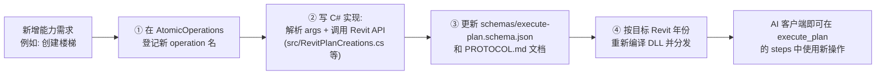

# 常见问题（FAQ）

关于 Revit Command Bridge 工作机制的高频问题，内容整理自工程审查报告与机制问答。协议细节见 [PROTOCOL.md](../PROTOCOL.md)，架构原则见 [ARCHITECTURE.md](../ARCHITECTURE.md)，能力扩展见 [EXTENSION-PLAN.md](./EXTENSION-PLAN.md)。

---

# 工程审查报告（2026-08-23）

## Summary

这是一个"本地命令桥"工程：用**文件队列 + Revit ExternalEvent** 解耦 AI 客户端与 Revit 进程。AI 客户端（Codex、WorkBuddy、Claude Desktop 等 MCP 客户端）通过 Node.js MCP Server 把受控 JSON 命令写入本地队列，Revit 插件轮询队列后在主线程以白名单原子操作 + 单一 Transaction 执行。整体架构清晰、安全边界明确，未发现严重问题。

## Issues Found

No issues found.

## Q4：工程整体结构是怎样的？

| 目录/文件 | 作用 |
| --- | --- |
| [`src/`](../src/RevitCommandBridgeApp.cs) | Revit 插件 C# 源码（按年份编译的 DLL，`IExternalApplication` 入口） |
| [`scripts/`](../scripts/revit-mcp-server.mjs) | 传输层：MCP Server、REST 网关、CLI、OpenAI 兼容本地助手 |
| [`setup/RevitAIHubSetup.cs`](../setup/RevitAIHubSetup.cs) | 单文件安装器（自动扫描 Revit 2020–2024、生成适配 DLL、配置 AI 客户端） |
| [`deploy/RevitCommandBridge.addin.template`](../deploy/RevitCommandBridge.addin.template) | Revit 插件注册清单模板 |
| [`schemas/execute-plan.schema.json`](../schemas/execute-plan.schema.json) | `execute_plan` 机器可读校验契约 |
| [`examples/`](../examples/preview-universal-plan.json) | 各类请求 JSON 示例 |
| [`README.md`](../README.md) / [`ARCHITECTURE.md`](../ARCHITECTURE.md) / [`PROTOCOL.md`](../PROTOCOL.md) / [`CONNECTORS.md`](../CONNECTORS.md) | 使用、架构、协议、客户端接入文档 |

`src/` 内部分工：[`RevitCommandBridgeApp.cs`](../src/RevitCommandBridgeApp.cs)（Ribbon 入口）→ [`BridgeRuntime.cs`](../src/BridgeRuntime.cs)（轮询 + ExternalEvent 调度）→ [`BridgeFileQueue.cs`](../src/BridgeFileQueue.cs)（文件队列）→ [`RevitCommandExecutor.cs`](../src/RevitCommandExecutor.cs)（顶层 operation 分发）→ [`PlanCommandExecutor.cs`](../src/PlanCommandExecutor.cs)（`execute_plan` 原子步骤 + 事务）；专业能力在 `RevitPlanCreations/Queries/Mutations`、`RevitFamilyOperations`、`RevitOutputOperations` 等文件中。

## Q5：如何使用？

1. **安装**：普通用户直接运行 `release/RevitCommandBridgeSetup.exe`；开发者用 `build.ps1 -RevitVersion 2020` + `install-revit.ps1`。安装器自动扫描 Revit 2020–2024、按年份生成队列目录 `%LOCALAPPDATA%\RevitCommandBridge\<year>`。
2. **连接 AI 客户端**：安装器自动识别并合并 MCP 配置（Codex、WorkBuddy、Claude Desktop、Cursor、Windsurf、Cline、Roo Code）；或在 Revit 功能区点"复制 MCP"按钮粘贴配置。配置指向内置 Node 运行时启动 [`scripts/revit-mcp-server.mjs`](../scripts/revit-mcp-server.mjs)。
3. **日常流程**（见 [`ShowHelpCommand`](../src/RevitCommandBridgeApp.cs)）：启动 Revit 并打开项目 → 桥接自动启动 → 在 AI 对话框先发"只查询"命令认识项目（标高/族/类型）→ 提交建模计划 `preview=true` 预览 → 确认无误后 `preview=false` 执行 → 可用 Revit 原生 `Ctrl+Z` 一次撤销整个计划。
4. **其它入口**：REST 网关 [`scripts/revit-http-gateway.mjs`](../scripts/revit-http-gateway.mjs)（仅 127.0.0.1:8765）、PowerShell CLI [`scripts/send-revit-command.ps1`](../scripts/send-revit-command.ps1)、纯文件读写 inbox/outbox、OpenAI 兼容本地助手 [`scripts/revit-openai-compatible-chat.mjs`](../scripts/revit-openai-compatible-chat.mjs)。

## Q6：谁是 MCP 的承接方？

**承接方（MCP Server）是 [`scripts/revit-mcp-server.mjs`](../scripts/revit-mcp-server.mjs)——一个由 MCP 客户端作为子进程拉起的 Node.js stdio JSON-RPC 服务**。它自己**不直接接触 Revit API**，只做三件事：

- 通过 `handleLine()` 处理 JSON-RPC（`initialize` / `tools/list` / `tools/call`）；
- 通过 `toolDefinitions()` 暴露工具：主入口 `revit_execute_plan`，通用 `revit_command`，以及 `revit_health`、`revit_create_family` 等直达工具；
- 通过 `invokeRevit()` 把工具调用转换为队列文件，并轮询取回结果。

真正的 Revit 控制端是**编译进 Revit 进程的 C# 插件**（[`RevitCommandBridgeApp`](../src/RevitCommandBridgeApp.cs)），双方以本地文件队列握手，完全进程解耦。

## Q7：MCP 控制 Revit 的完整链路是怎样的？

```text
MCP 客户端(Codex等) ─stdio─> revit-mcp-server.mjs ─写文件─> inbox/*.request.json
                                                              │ (每300ms轮询)
Revit 进程内: BridgeRuntime 定时器 ─Raise─> ExternalEvent ─主线程─> ProcessOne()
   ├─ TryClaimNext(): inbox → processing（原子 Move）
   ├─ RevitCommandExecutor.Execute(): 校验文档标题/只读状态/operation 白名单
   ├─ PlanCommandExecutor: 500 步以内的原子步骤串行执行，
   │    全部写步骤包在一个 Transaction（失败即 RollBack，all-or-nothing）
   └─ Complete(): 结果写 outbox/{id}.result.json，请求归档 archive/
                                                              │
revit-mcp-server.mjs <─每200ms轮询 outbox─ waitForCommandResult() ─JSON文本─> MCP 客户端
```

关键机制：

1. **入队**：`enqueueCommand()`（[`scripts/bridge-client.mjs`](../scripts/bridge-client.mjs)）先检查 ID 三处冲突（inbox/processing/outbox），再"临时文件 + 原子重命名"写入，避免 Revit 读到半截文件。
2. **活性检测**：`isBridgeRunning()` 校验 `status.json` 心跳（state 为 running/busy 且 5 秒内更新），Revit 未启动时直接拒绝提交。
3. **线程模型**：[`BridgeRuntime`](../src/BridgeRuntime.cs) 用后台 `Timer` 每 300ms 轮询 inbox，有请求时 `SignalQueue()` 触发 `ExternalEvent.Raise()`；Revit 随后在**主线程**回调 `BridgeEventHandler.Execute()` → `ProcessOne()`，符合 Revit API 只能在主线程调用的约束。
4. **事务与回滚**：[`PlanCommandExecutor`](../src/PlanCommandExecutor.cs) 把普通写步骤包进一个名为"RCB 通用建模计划"的 `Transaction`，任一步失败整体 `RollBack()`；`export`/`save_document` 有外部文件副作用，强制单独成计划。
5. **崩溃恢复**：启动时 `RecoverProcessingRequests()`（[`src/BridgeFileQueue.cs`](../src/BridgeFileQueue.cs)）把残留的 processing 请求移回 inbox 重跑或按已有结果归档。
6. **安全边界**：不接受任意 C#/Python，只接受白名单原子操作（约 40 个，见 [`AtomicOperations`](../src/PlanCommandExecutor.cs)）；`preview=true` 干跑；`document_title` 匹配、只读文档拒写、1MB 请求上限；REST 仅绑 127.0.0.1。

## Recommendation

**APPROVE** — 架构上"MCP Server（Node，客户端子进程）↔ 文件队列 ↔ Revit 插件（ExternalEvent 主线程）"的分层干净且各司其职；文档与代码一致性好；安全与事务边界处理到位。2021–2024 适配包仍需在装有对应 Revit 的机器上完成真机回归（文档已如实标注为 [T] 状态）。

---

# 机制问答

## Q1：Revit 插件是"固定时间轮询某个地方的脚本文件"吗？

基本正确，但有一个关键细节：轮询的对象**不是"脚本"，而是 JSON 数据文件**。

[`BridgeRuntime`](../src/BridgeRuntime.cs) 的后台 Timer 每 **300ms** 扫描一次 `%LOCALAPPDATA%\RevitCommandBridge\<year>\inbox\` 目录里的 `{id}.request.json`。JSON 里只有 `operation`（操作名）+ `args`（参数），**不含任何可执行代码**——这是刻意设计的安全边界。

## Q2：轮询到的内容可以通过 Revit API 操作 Revit 软件吗？

是的。插件读到 JSON 后，由 [`RevitCommandExecutor.Execute()`](../src/RevitCommandExecutor.cs) 分发，例如 `execute_plan` 走 [`PlanCommandExecutor`](../src/PlanCommandExecutor.cs)：解析每个步骤 → 翻译成对应的 Revit API 调用（`Wall.Create`、`Pipe.Create`、`ViewSection.Create` 等）→ 包进一个 Transaction 在主线程执行 → 结果写回 outbox。

## Q3：Revit 那么多 API 都能操作到吗？

**不能。这是白名单机制，扩展必须在插件端写 C#。**

Revit API 有数千个对象，本桥接**只开放约 40 个手工实现的原子操作**（见 [`AtomicOperations`](../src/PlanCommandExecutor.cs) 数组）。插件在执行前会校验：

- [`PlanCommandExecutor.cs`](../src/PlanCommandExecutor.cs)：`if (!AtomicOperations.Contains(operation, ...))` → 未登记的步骤操作**直接拒绝**；
- [`RevitCommandExecutor.cs`](../src/RevitCommandExecutor.cs)：未登记的顶层 operation 同样报"不支持"。

所以 **AI 永远无法调用白名单之外的 Revit API**。想支持新能力，需要开发者在**插件端（C#）**继续增加"JSON 翻译为 Revit API"的代码：



注意几个要点：

- **MCP 端几乎不用改**：`revit_execute_plan` 工具的 `steps[].operation` 在 MCP schema 里就是开放字符串（[`revit-mcp-server.mjs`](../scripts/revit-mcp-server.mjs)），真正把关的是插件端白名单。只有新增"顶层操作"（如当年的 `create_family`）才需要同步更新 [`supportedOperations()`](../scripts/bridge-client.mjs)。
- **为什么不开放全部 API**：[`ARCHITECTURE.md`](../ARCHITECTURE.md) "为什么不让 AI 直接跑 C# 或 Dynamo"一节明确回答了这个问题——AI 会产生错误的任意代码；白名单让桥接能校验目标文档、预览、事务、单位、元素 ID，并留下审计记录。开放任意 API 等于让 AI 直接在 Revit 进程里跑代码，风险不可控。
- **为什么不担心"40 个不够用"**：设计哲学是**组合优于穷举**。这 40 个原子操作是按"高频、可组合"挑选的——"24 根不同标高的管道 + 阀门 + 连接 + 写系统编号 + 选中复核"是一个 `execute_plan` 计划，而不是 24 个新命令。幕墙、楼梯、嵌套族等专用对象在 [`ARCHITECTURE.md`](../ARCHITECTURE.md) 的"已知边界"中标注为 [T]（待按需增加原子操作）。
- **每个 Revit 年份要单独编译**：新增原子操作后需为 2020–2024 各年份重新编译对应 DLL（API 版本不兼容，不能共用一个 DLL）。

**一句话总结**：MCP/JSON 侧是"开放的传声筒"，Revit 插件侧是"收紧的执行器"——能力边界由插件端 C# 白名单决定，未来扩展 = 插件端加代码 + 重新编译，AI 客户端零改动。具体扩展步骤与优先级路线图见 [EXTENSION-PLAN.md](./EXTENSION-PLAN.md)。
